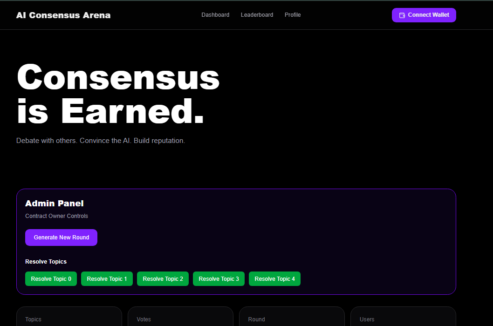
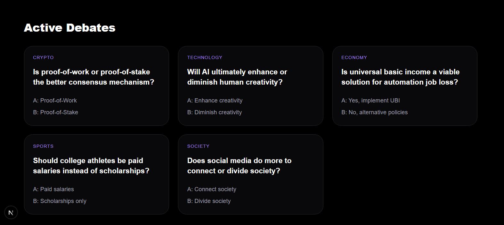
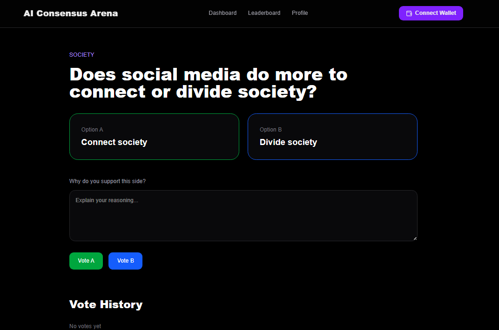
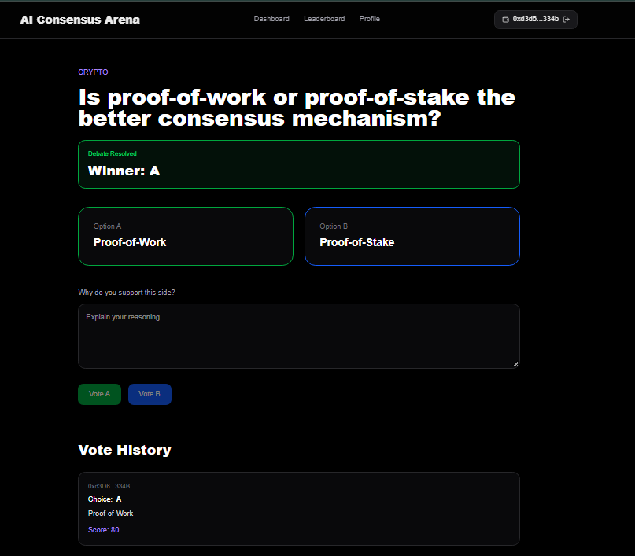
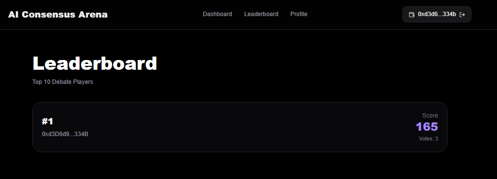
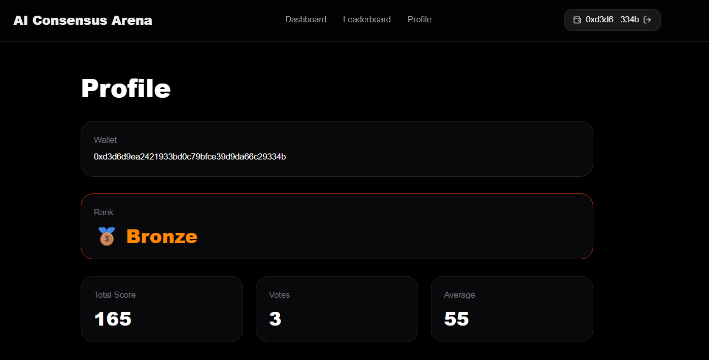

## Why GenLayer?

Consensus Arena relies on GenLayer Intelligent Contracts to:

- Generate new debate topics using AI
- Evaluate arguments through decentralized AI consensus
- Score participants automatically
- Resolve debates without centralized moderators

These capabilities cannot be implemented using traditional deterministic smart contracts alone.

# Consensus Arena

Consensus Arena is an AI powered debate platform built on GenLayer.

Users participate in structured debates, vote on opposing viewpoints, submit arguments, and earn reputation through AI assisted consensus.

The platform combines decentralized voting, reputation systems, and GenLayer's intelligent contract capabilities to create a transparent environment for collective decision-making.

---

## Features

### AI Generated Debate Topics

New debate rounds can be generated automatically using GenLayer intelligent contracts.

Each round contains:

* Crypto
* Technology
* Economy
* Sports
* Society

topics with two opposing viewpoints.

---

### Voting System

Users can:

* Choose Side A or Side B
* Submit a supporting argument
* Participate in community consensus

Each wallet can vote once per topic.

---

### AI-Powered Resolution

After a debate concludes:

* Arguments are evaluated by AI
* Each participant receives a quality score
* A winning side is selected

The evaluation process is executed through GenLayer intelligent contracts.

---

### Reputation Engine

Users accumulate:

* Total Score
* Vote Count
* Average Score

creating a transparent on-chain reputation system.

---

### Leaderboard

Top participants are ranked according to:

* Reputation Score
* Participation
* Debate Performance

---

## Tech Stack

Frontend

* Next.js
* React
* TailwindCSS

Blockchain

* GenLayer
* genlayer-js

Smart Contracts

* Python Intelligent Contracts

---

## Project Structure

src/

* app/
* components/
* hooks/
* services/
* context/

contract/

* ConsensusArena.py

---

## Local Development

Install dependencies:

npm install

Run development server:

npm run dev

Open:

http://localhost:3000

---

## Smart Contract

The ConsensusArena contract manages:

* Debate rounds
* Voting
* AI judging
* User reputation
* Leaderboards

---

## Future Roadmap

* NFT Debate Badges
* Seasonal Rankings
* Advanced AI Judges
* DAO Governance
* Tokenized Rewards
* Multi Round Tournaments

---

## License

MIT License

---

Built with GenLayer.

# Screenshots

## Dashboard

## Active Debates

## Leaderboard

## Profile

